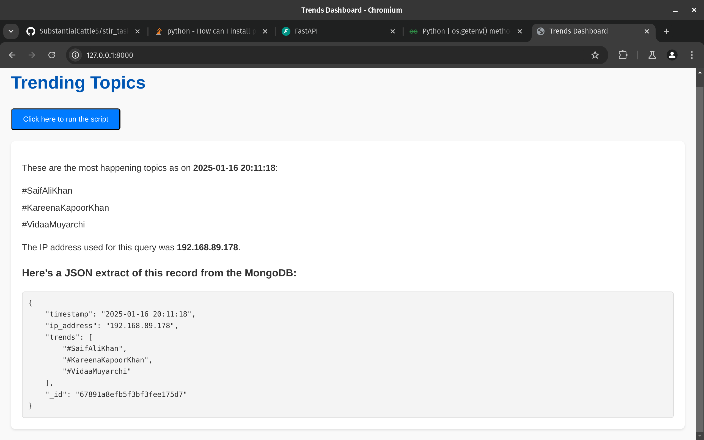
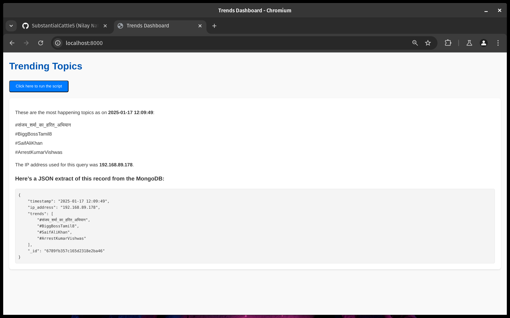
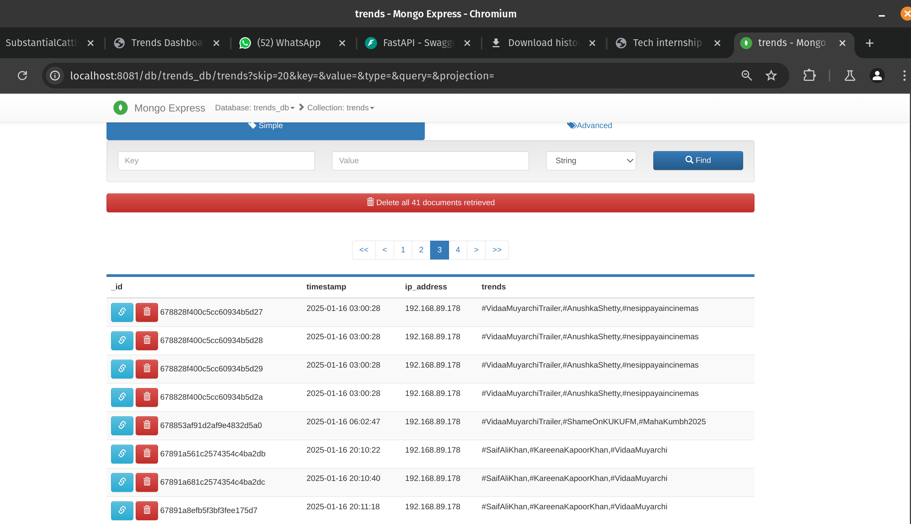

# Twitter Trending Topics Scraper

This project demonstrates a Selenium-based web scraper that fetches the top 5 trending topics from Twitter's "What’s Happening" section, stores the results in a MongoDB database, and displays the information on an HTML page using FastAPI.

---

## Features
1. Automates Twitter login using Selenium to access the homepage.
2. Fetches the top trending topics under the "What’s Happening" section.
3. Uses ProxyMesh to ensure that each scraping request originates from a new IP address.
4. Assigns a unique ID to each run of the Selenium script and stores the results in MongoDB.
5. FastAPI serves an HTML page where users can:
   - Trigger the Selenium script to fetch data.
   - View the top 5 trending topics, the IP address used, and the MongoDB record in JSON format.
6. Provides a seamless way to configure credentials via environment variables.

---

## Prerequisites
- **Python 3.8 or later**
- **Node.js** (for serving the frontend if needed)
- **MongoDB** (Local or cloud-based instance like MongoDB Atlas)
- **Twitter Account** (required for login)
- **ProxyMesh API Key** (to rotate IP addresses during scraping)

---

## Installation and Setup
### 1. Clone the repository
```bash
git clone git@github.com:SubstantialCattle5/stir_task.git
cd stir_task
```

### 2. Set up environment variables
Copy the `.env.example` file to `.env`:
```bash
cp .env.example .env
```

Fill in the following credentials in the `.env` file:
- `TWITTER_EMAIL`: Your Twitter email or username.
- `TWITTER_PASSWORD`: Your Twitter password.
- `MONGO_URI`: MongoDB connection URI.

### 3. Install dependencies
Create a virtual environment and install the required packages:
```bash
python -m venv venv
source venv/bin/activate  # For Linux/MacOS
venv\Scripts\activate     # For Windows

pip install -r requirements.txt
```

### 4. Docker file for MongoDB (optional)
You can also set up MongoDB using Docker:
```bash
docker compose up -d
```

### 5. Run the application
To start the FastAPI application in development mode:
```bash
uvicorn src.main:app --reload
```

---

## Usage
1. **Access the HTML page:**  
   Open your browser and navigate to `http://127.0.0.1:8000`.
2. **Run the Selenium Script:**  
   Click the "Run the script" button on the page to:
   - Trigger the Selenium script.
   - View the top 5 trending topics and the MongoDB JSON record.
3. **JSON Response Format:**  
   After executing the script, the webpage will display:
   - The top 5 trending topics.
   - The IP address used for scraping.
   - The MongoDB JSON record for the script run.

---

## Project Structure
```
src/
├── controllers
│   ├── __init__.py
│   └── TwitterScrapperController.py
├── __init__.py
├── main.py
├── models
│   ├── __init__.py
│   ├── mongodb.py
├── services
│   ├── __init__.py
│   └── TwitterScrapper.py
└── views
    ├── __init__.py
    ├── static
    └── templates
        └── index.html
```

---

## Example Output
### HTML Page Screenshot
Below is a screenshot of the HTML page displaying the trending topics:





**Note:** The IP address in the screenshots is the same because the free trial proxy provided by ProxyMesh has been blacklisted by Twitter. However, the application still supports proxy routing and IP rotation. For further instructions on setting up ProxyMesh and rotating IPs, refer to [Twitter Scrapper Service](doc/README.md).

### MongoDB JSON Record Screenshot
Here’s a screenshot of the MongoDB JSON record displayed on the HTML page:



---

## Notes
1. **Environment Variables**  
   Ensure the `.env` file is correctly set up before running the application.
2. **Browser Driver**  
   The Selenium script uses a web driver (e.g., ChromeDriver). Download and configure the driver compatible with your browser.
3. **ProxyMesh Configuration**  
   The application supports ProxyMesh. For detailed setup instructions, refer to the [Twitter Scrapper Service](doc/README.md).
4. **Dependencies**  
   Install required Python libraries using `requirements.txt`.

